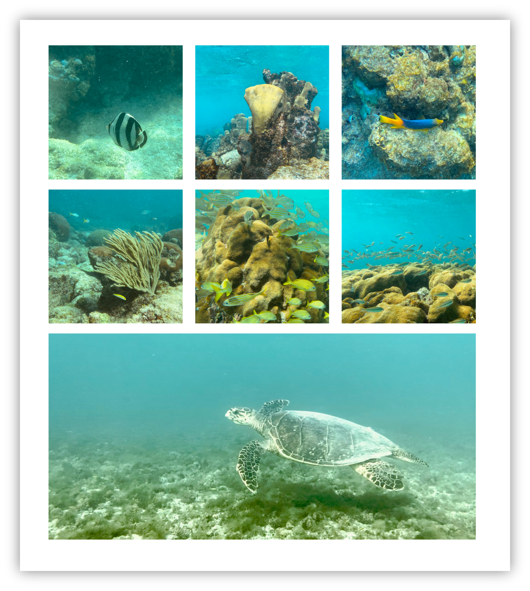
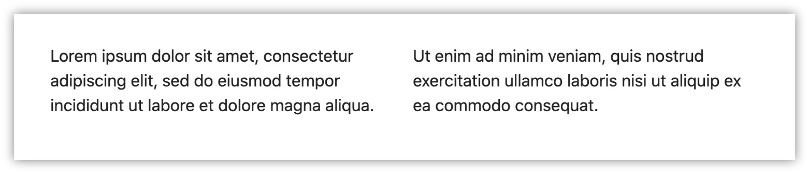
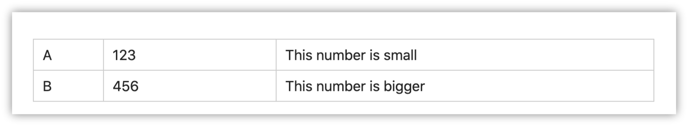
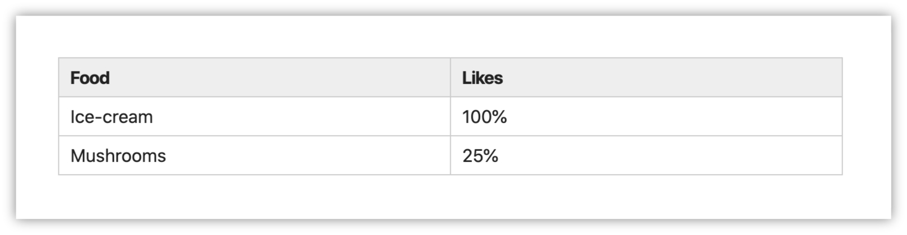

# Flexdown Obisidian Plugin

This [Obsidian](https://obsidian.md) plugin lets you create layouts with flexible columns (using the [flexbox model](https://developer.mozilla.org/en-US/docs/Learn/CSS/CSS_layout/Flexbox)) or tables. It is intended to be a complement to markdown tables. Some of the pain points it solves:
- Cells can have complex markdown like lists, paragraphs, and images.
- The layout does not need to be a grid.
- It is easy to manage layouts (and tables) with lots of data.
- It is simple to convert regular markdown into a flexdown layout (and revert it) becaues the tags flow between the data, i.e., just replace blank lines with column and row dividers, and add the start & end tags.
- It has many options for controlling the layout.

## Basic Usage

Create the layout with a **flexdown** code block, eg:

````
```flexdown
```
````

To make new columns, put a "|" on a new line. To make new rows, put a "---" on a new line. 

````
```flexdown
This is great! I can have a list:
- with 
- some
- items
|
And a second column can have
paragraphs
**and**
many other items.
---
Cool, right? And it doesn't have to be a grid!
```
````

**Output**


Images resize to fit their cells by default. This example shows several features:
- Hide the border with the [border:none](#bordernone) option.
- Set the flex (resizing) rule for all the items using the [flex-all](#flex-all) option. The items are set an initial width of 200 pixels, but are still allowed to grow to fill the space.
- The first 6 images are all in one "row" and are allowed to wrap to fill up the space.
- The last image is in its own row, the initial width is 200px, but it will grow to fill up the space.

````
```flexdown
%% flex-all: 200px
%% border: none

|

|

|

|

|

---

```
````

**Output**


## Options

Options start with "\%\%". The options are usually specified at the start of the block, but it's not necessary, and there are exceptions.


### `border:none`

Flexdown will render a border by default, but you can hide it with this option.

**Usage**
```
%% border: none
```

Render the layout without a border, eg
````
```flexdown
%% border: none
Lorem ipsum dolor sit amet, consectetur adipiscing elit, sed do eiusmod tempor incididunt ut labore et dolore magna aliqua. 
|
Ut enim ad minim veniam, quis nostrud exercitation ullamco laboris nisi ut aliquip ex ea commodo consequat.
```
````

**Output**


### `flex:`

**Usage**
```
%% flex: <column 1 flex value>, <column 2 flex value>, ...
```

Specify column width ratios with the flex option. For example:
````
```flexdown
%% flex: 1, 3, 7
A
|
123
|
This number is small
---
B
|
456
|
This number is bigger
```
````

**Output**


This option sets the inline `flex` CSS attribute on each column. Specify as many (or few) as you like, separated by commas.

The **flex value** can be any of the variations of the [flex attribute](https://developer.mozilla.org/en-US/docs/Web/CSS/flex), eg
```
// Specify only flex-grow
flex: 1

// Specify flex-grow and flex-basis
flex: 0 100px
```

The default style is `flex: 1`


### `flex-all:`

**Usage**
```
%% flex-all: <flex value>
```

Set the `flex` style for all items. The `%% flex` option can still be used and takes precedence.

### `display: table`

**Usage**
```
%% display: table
```

Render the layout as a table instead of flexbox. This is useful if you need a grid or need the cells to line up, because flexbox can be too flexible sometimes.

### `header`

**Usage**
```
%% header
```

Place this at the start of any row that you want to emphasize, and it will be rendered with a background color and bold text.

````
```flexdown
%% header
Food
|
Likes
---
Ice-cream
|
100%
---
Mushrooms
|
25%
```
````

**Output**



## CSS Style
These are the styles used, which can be customized:
```css
/* Change the border color with this variable */
--flexdown-border-color:  #ccc;

.flexdown-row 
.flexdown-column 

/* Emphasize rows marked as headers */
.flexdown-header-row

/*
  When a border is rendered, this class is added to
  the parent of all the .flexdown-row elements, so you can
  customize these classes.
*/
.flexdown-border
.flexdown-border .flexdown-row
.flexdown-border .flexdown-column

/* When "display: table" is used to render as <table></table>: */
table.flexdown 
table.flexdown th
table.flexdown td > img 
table.flexdown td > *
```
